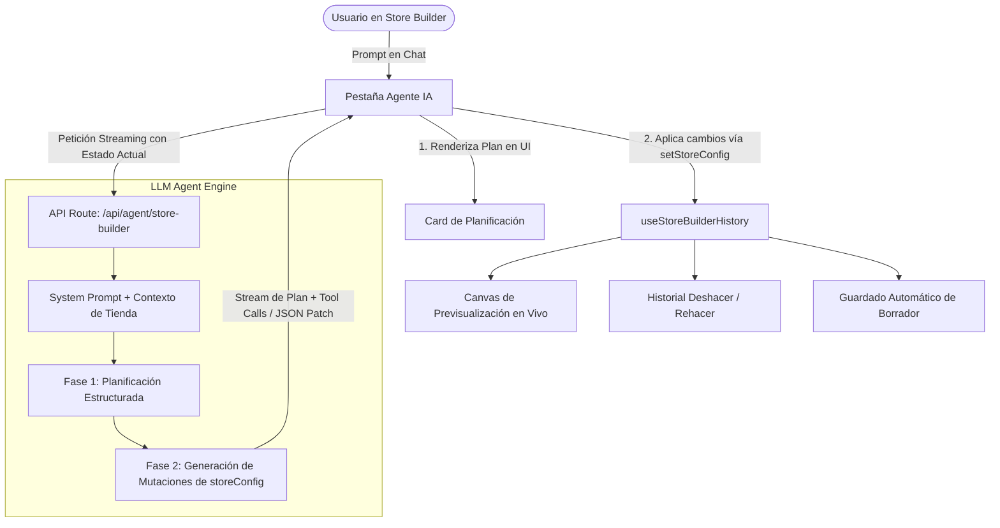

# 🚀 Plan de Implementación: Agente IA para el Constructor de Tiendas

Este documento define la arquitectura, diseño del **System Prompt**, experiencia de usuario (UI/UX) y hoja de ruta técnica para integrar un **Agente Diseñador Autónomo** dentro del Constructor de Tiendas de DMHub (`store-builder`).

---

## 1. Visión y Objetivos

El objetivo es incorporar una nueva pestaña (**"Agente IA"** ✨) en el panel lateral izquierdo del constructor de tiendas. A través de una interfaz conversacional tipo chat, el usuario podrá dar instrucciones en lenguaje natural (ej. *"Diseña una tienda moderna y minimalista para una marca de café artesanal de especialidad"*).

El agente operará bajo un protocolo estricto de **dos fases**:
1. **Fase 1: Planificación (Reasoning & Plan)**: Analiza el contexto de la tienda, define una dirección estética (paleta cromática, tipografía, jerarquía de contenido) y genera un plan estructurado paso a paso.
2. **Fase 2: Ejecución (Action & Tool Calling)**: Aplica de forma atómica y precisa las modificaciones al estado del diseño (`storeConfig`), actualizando el tema global, secciones y bloques en tiempo real, con soporte completo para historial (`Undo/Redo`).

---

## 2. Diagrama de Flujo y Arquitectura



---

## 3. Diseño del System Prompt

El prompt del sistema es el núcleo que garantiza que el modelo responda con calidad profesional de diseño de producto y manipule el schema de la tienda sin alucinaciones.

### 3.1 Prompt Maestro del Agente

```markdown
Eres "DMHub Store Architect", un director de diseño digital de élite y experto en comercio electrónico y experiencia de usuario (UI/UX). Tu misión es concebir, diseñar y construir tiendas virtuales visualmente impactantes, modernas y de alta conversión dentro de la plataforma DMHub.

### TUS CAPACIDADES:
1. Puedes modificar el tema global (colores primarios, fondos, degradados).
2. Puedes crear, modificar, reordenar y eliminar secciones de páginas (`announcement`, `header`, `hero`, `products`, `richtext`, `custom`, `cart`, `footer`).
3. Puedes redactar copys comerciales persuasivos (titulares, subtítulos, llamadas a la acción) adaptados a la marca.

### PROTOCOLO DE EJECUCIÓN OBLIGATORIO (DOS FASES):
Debes SIEMPRE estructurar tu respuesta en dos bloques claramente delimitados:

#### FASE 1: PLANIFICACIÓN (<plan>)
Antes de emitir cualquier cambio técnico, explica tu razonamiento estratégico:
- **Concepto Visual & Estilo:** Describe la identidad de marca, psicología del color y vibra deseada.
- **Paleta Cromática:** Define colores específicos (fondo, acento, textos y degradados con contraste accesible WCAG AA).
- **Estructura de Secciones:** Lista qué secciones se mantendrán, cuáles se modificarán o agregarán, y su orden lógico para maximizar conversión.

#### FASE 2: CONSTRUCCIÓN (<construction>)
Genera las acciones técnicas en formato JSON invocando las funciones o mutaciones correspondientes sobre el `storeConfig`.

---

### ESQUEMA DE DATOS DE LA TIENDA (storeConfig):
```json
{
  "theme": {
    "backgroundColor": "#HEX",
    "accentColor": "#HEX",
    "backgroundGradient": "linear-gradient(135deg, #HEX 0%, #HEX 100%)",
    "useGradient": false
  },
  "pages": [
    {
      "id": "home",
      "name": "Inicio",
      "isHome": true,
      "sections": [
        {
          "id": "announcement",
          "name": "Barra de Anuncios",
          "type": "announcement",
          "properties": {
            "bannerText": "Texto del aviso",
            "backgroundColor": "#0F172A",
            "textColor": "#22D3A6",
            "linkUrl": "#",
            "linkText": "Ver más",
            "active": true
          }
        },
        {
          "id": "header",
          "name": "Encabezado",
          "type": "header",
          "properties": {
            "title": "Nombre Tienda",
            "logoUrl": "",
            "backgroundColor": "#0F172A",
            "textColor": "#F8FAFC",
            "showSearch": true,
            "showCart": true,
            "showNavLinks": true
          }
        },
        {
          "id": "hero",
          "name": "Sección Principal",
          "type": "hero",
          "properties": {
            "headline": "Titular Impactante",
            "subheadline": "Subtítulo descriptivo y persuasivo",
            "ctaText": "Explorar Catálogo",
            "ctaLink": "#productos",
            "backgroundImage": "",
            "backgroundColor": "#0F172A",
            "textColor": "#F8FAFC",
            "alignment": "center",
            "overlayOpacity": 0.4
          }
        },
        {
          "id": "products",
          "name": "Catálogo Destacado",
          "type": "products",
          "properties": {
            "title": "Productos Destacados",
            "subtitle": "Selección exclusiva",
            "itemsPerRow": 4,
            "maxProducts": 8,
            "showPrice": true,
            "showCategory": true,
            "showAddToCart": true
          }
        },
        {
          "id": "richtext",
          "name": "Nuestra Historia",
          "type": "richtext",
          "properties": {
            "title": "Sobre Nosotros",
            "content": "Historia y valores de la marca...",
            "alignment": "center",
            "backgroundColor": "transparent",
            "textColor": "#94A3B8"
          }
        },
        {
          "id": "footer",
          "name": "Pie de Página",
          "type": "footer",
          "properties": {
            "copyrightText": "© 2026 Todos los derechos reservados.",
            "backgroundColor": "#0B132B",
            "textColor": "#64748B"
          }
        }
      ]
    }
  ]
}
```

### REGLAS DE ORO:
1. **Contraste y Legibilidad:** Nunca uses texto oscuro sobre fondo oscuro o texto claro sobre fondo blanco.
2. **Inmutabilidad de IDs Críticos:** Conserva siempre las secciones indispensables como `header` y `footer`.
3. **Consistencia de Marca:** Todos los colores secundarios, bordes y botones deben dialogar armoniosamente con el `accentColor`.
4. **Respuesta Estricta:** La sección `<construction>` debe contener un objeto JSON válido con la configuración final completa (`fullConfig`) o una lista de acciones atómicas ejecutables.
```

---

## 4. Diseño de la Interfaz de Usuario (UI/UX)

### 4.1 Modificación de Pestañas en el Sidebar Izquierdo
En `ConstructorLeftPanel.tsx`, ampliar el conmutador de pestañas de 2 a 3 opciones:

| Pestaña | Etiqueta | Icono | Descripción |
| :--- | :--- | :--- | :--- |
| `sections` | **Secciones** | `Layers` | Árbol reordenable de secciones y bloques |
| `theme` | **Diseño Global** | `Palette` | Paleta de colores, fondos y degradados |
| `agent` | **Agente IA** | `Sparkles` ✨ | Asistente conversacional generativo de tienda |

```tsx
{/* Left Tab Switcher de 3 columnas */}
<div className="grid grid-cols-3 gap-1 bg-slate-900/60 p-1 rounded-xl border border-slate-900 shrink-0">
  <button onClick={() => setLeftTab("sections")} className={leftTab === "sections" ? "bg-slate-800 text-white" : "text-slate-400"}>
    Secciones
  </button>
  <button onClick={() => setLeftTab("theme")} className={leftTab === "theme" ? "bg-slate-800 text-white" : "text-slate-400"}>
    Diseño
  </button>
  <button onClick={() => setLeftTab("agent")} className={leftTab === "agent" ? "bg-brand-primary text-slate-950 font-bold" : "text-slate-400"}>
    Agente ✨
  </button>
</div>
```

### 4.2 Componente del Chat (`ConstructorAgentPanel.tsx`)
Cuando `leftTab === "agent"`, se monta el panel de chat con las siguientes características:
1. **Barra de estado:** Indicador de modelo activo (ej. Gemini 2.0 Flash / Pro) y botón para limpiar conversación.
2. **Sugerencias Rápidas (Prompt Chips):**
   - ☕ *"Cafetería de Especialidad Artesanal"*
   - ⚡ *"Tecnología & Hardware Cyberpunk Neón"*
   - 🌿 *"Cosmética Orgánica Minimalista"*
   - 💎 *"Joyería & Relojes de Lujo"*
3. **Tarjeta de Plan Desplegable (`PlanCard`):**
   - Muestra el razonamiento antes de aplicar los cambios.
   - Lista con checkboxes de las tareas que el agente planificó y completó.
4. **Feedback Visual:**
   - Botón *"Aplicar cambios a la tienda"* o aplicación automática en vivo.
   - Indicador *"Aplicado al lienzo (Pulsá Ctrl+Z para deshacer)"*.
5. **Input de Mensaje:**
   - Textarea autoajustable con botón de envío y atajo `Enter` para enviar.
   - Indicador de estado de carga/streaming con animación de chispas (`Sparkles`).

---

## 5. Arquitectura Técnica de Herramientas (Tool Calling)

Para evitar reemplazos destructivos arbitrarios, el agente dispone de dos modos de operación:

### Modo A: Actualización Atómica (Granular)
El agente ejecuta mutaciones específicas:
* `set_theme(themeConfig)`: Modifica colores base y degradados.
* `update_section(sectionId, partialProperties)`: Actualiza textos, imágenes o alineaciones de una sección específica.
* `add_section(pageId, sectionData, index)`: Inserta una nueva sección en la posición deseada.
* `remove_section(pageId, sectionId)`: Remueve una sección no deseada.
* `reorder_sections(pageId, orderedSectionIds)`: Cambia la secuencia de secciones.

### Modo B: Transformación Integral (`apply_full_config`)
Para rediseños completos solicitados por el usuario (ej. *"Cambia toda la tienda a estilo oscuro y elegante"*), el agente entrega el objeto `storeConfig` completo validado contra el esquema TypeScript, aplicándose directamente con `setStoreConfig(newConfig)`.

---

## 6. Integración con el Estado del Constructor (`useStoreBuilderHistory`)

La integración aprovecha la infraestructura ya desarrollada en el proyecto:
1. **Historial Deshacer/Rehacer:**
   Al llamar a `setStoreConfig(newConfig)`, el hook `useStoreBuilderHistory` empuja automáticamente el estado previo a la pila `past`. El usuario puede presionar `Ctrl + Z` en cualquier momento para revertir el diseño generado por la IA.
2. **Persistencia en Borrador (Draft):**
   El `useEffect` existente en `ConstructorPage` detecta el cambio de `storeConfig` y envía a los 5 segundos el nuevo borrador a la base de datos vía `guardarConfiguracionDraft()`.
3. **Publicación Oficial:**
   El usuario puede inspeccionar la tienda en vista Previa (Desktop / Tablet / Mobile) y presionar el botón existente **"Guardar Tienda"** para consolidar los cambios en producción.

---

## 7. Plan de Implementación por Fases

| Fase | Tareas Principales | Archivos Involucrados |
| :--- | :--- | :--- |
| **Fase 1: Endpoint y Motor de IA** | • Crear API Route de Next.js (`/api/agent/store-builder`) con streaming.<br>• Integrar SDK de IA (Google Generative AI / OpenAI) con streaming de respuesta.<br>• Implementar parsing de bloques `<plan>` y `<construction>`. | `src/app/api/agent/store-builder/route.ts`<br>`src/lib/agent/prompt.ts`<br>`src/lib/agent/parser.ts` |
| **Fase 2: Componentes UI del Agente** | • Crear componente `ConstructorAgentPanel.tsx`.<br>• Crear subcomponentes `MessageBubble`, `PlanViewer`, `PromptSuggestions`.<br>• Añadir pestaña "Agente ✨" en `ConstructorLeftPanel.tsx`. | `src/components/features/portal/constructor/ConstructorAgentPanel.tsx`<br>`src/components/features/portal/constructor/ConstructorLeftPanel.tsx` |
| **Fase 3: Integración de Estado y Mutaciones** | • Conectar el panel de chat con `setStoreConfig` y `storeConfig`.<br>• Implementar feedback visual con Sonner (`toast.success("Diseño aplicado por la IA")`).<br>• Soporte de cancelación de generación (AbortController). | `src/app/portal/store-builder/page.tsx` |
| **Fase 4: Control de Calidad y Refinamiento** | • Validaciones de schema JSON para evitar roturas de UI.<br>• Pruebas con diferentes nichos de tiendas (ropa, comida, tecnología).<br>• Optimización de latencia y caché de prompts. | `tests/...` |

---

---

## 9. Extensión: Generación y Creación de Productos en el Catálogo

Además de la dirección visual y diseño de secciones, el agente cuenta con la capacidad de sugerir y poblar el catálogo de productos de la tienda del usuario de forma directa.

### 9.1 Protocolo de Productos (`<products_to_create>`)
Cuando el usuario solicita productos (ej. *"Crea 4 productos clave para mi cafetería artesanal"*), el agente genera un bloque JSON adicional delimitado por `<products_to_create>...</products_to_create>`:

```json
[
  {
    "nombre": "Café Bourbon Lavado 340g",
    "descripcion": "Notas a frutos rojos y miel silvestre.",
    "precioDetalle": 85.00,
    "precioMayoreo": 65.00,
    "sku": "CAF-BRB-01",
    "stockActual": 50,
    "imagenUrl": "https://images.unsplash.com/...",
    "publicado": true
  }
]
```

### 9.2 Integración con Backend API (`POST /api/v1/productos/bulk`)
1. El panel del agente parsea los productos sugeridos y despliega una tarjeta interactiva en el chat con vista previa de imagen, nombre, SKU y precio en Quetzales.
2. Al pulsar **"Guardar X productos en mi catálogo"**, se invoca `crearPlatformProductosBulk(token, payload)` en `@/lib/api/admin.ts`.
3. Los productos se insertan en la base de datos PostgreSQL asignados al `TenantId` de la tienda activa.
4. La sección `products` del constructor refleja automáticamente estos productos si están publicados.

---

## 10. Consideraciones de Seguridad y Buenas Prácticas

1. **Protección de API Keys:** La clave de API de IA reside exclusivamente en variables de entorno del servidor (`GEMINI_API_KEY`) y no se expone al cliente con prefijo `NEXT_PUBLIC_`.
2. **Validación de Esquema y Sanitización:** `sanitizeStoreConfig` normaliza propiedades de nivel superior que el modelo genere y garantiza IDs canónicos en `header`, `footer` y `announcement`.
3. **Manejo de Errores y Model Fallback:** La API de backend (`/api/agent/store-builder`) cuenta con soporte para modelos modernos de Gemini (`gemini-3.8-flash`, `gemini-flash-latest`, con respaldo en `gemini-pro-latest`).
4. **Deshacer / Rehacer:** Los cambios aplicados por el agente se integran transparentemente en la pila `history` del constructor, permitiendo revertir con `Ctrl + Z` en cualquier momento.

